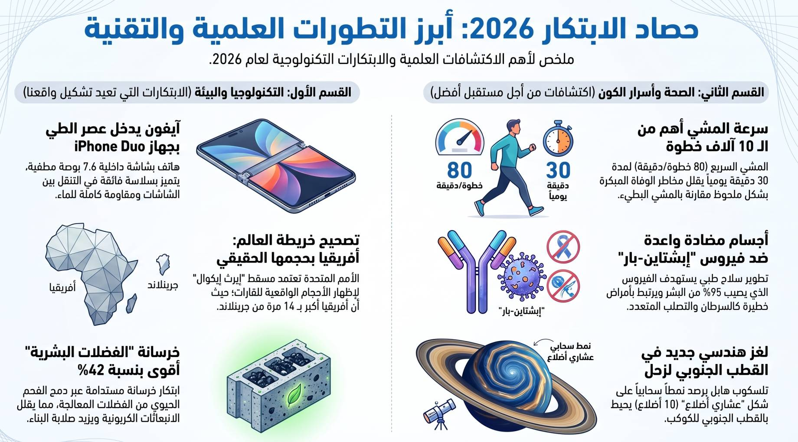
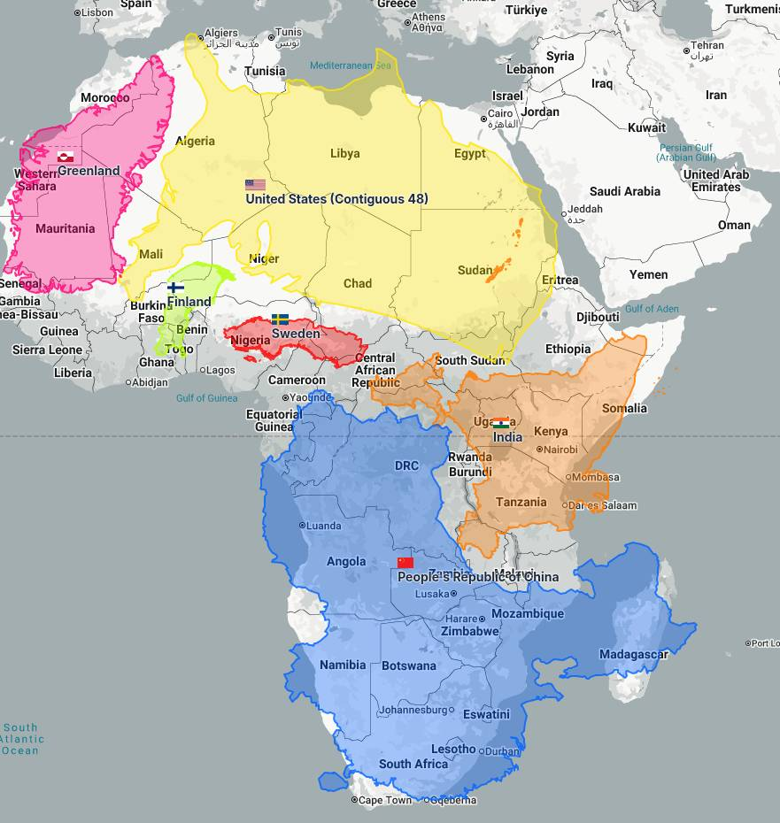

---
tags:
  - Health
  - Concrete
  - Map
title: اختيارات 6 | الأسبوع 37 | 2026
date: 2026-09-13
---

# اختيارات 6 | الأسبوع 37 | 2026

سلسلة من الاكتشافات العلمية والابتكارات التكنولوجية والقرارات الدولية التي تعيد تشكيل فهمنا للصحة والبيئة والتكنولوجيا والإدراك العالمي. ففي الوقت الذي تسعى فيه الأبحاث الطبية والبيئية لتقديم حلول مبتكرة تمتد من تحسين جودة الحياة والوقاية من الأمراض الشائعة إلى إعادة تدوير الفضلات والنفايات البشرية، تطور التكنولوجيا الاستهلاكية مفاهيم جديدة للأجهزة الذكية. كما تتزامن هذه التطورات مع خطوات دبلوماسية عالمية تهدف إلى تصحيح المفاهيم الجغرافية التاريخية وإعادة العدالة للمنظور العالمي. وتسلط هذه القضايا المتنوعة الضوء على كيف تتقاطع العلوم والتكنولوجيا والقرارات السياسية لصياغة مستقبل أكثر دقة وفعالية للبشرية.
<!-- more -->

*AI generated*

### 1. الأمم المتحدة تعتمد قراراً لتصحيح أحجام القارات على الخرائط
**Birleşmiş Milletler Haritalardaki Kıta Boyutlarını Düzeltme Kararını Onayladı**
صوتت الجمعية العامة للأمم المتحدة بأغلبية 164 صوتاً لصالح قرار يوصي المؤسسات والتطبيقات بوقف استخدام الخرائط التي تصغر حجم قارة أفريقيا. ويدعو القرار الذي قادته توغو ودول أفريقية إلى اعتماد مسقط Equal Earth وغيره من المساقط متساوية المساحة للحد من التشويه الذي يسببه مسقط مركاتور المعتمد منذ القرن السادس عشر. ويظهر هذا التشويه بوضوح في إظهار غرينلاند بحجم يماثل أفريقيا، رغم أن المساحة الحقيقية لأفريقيا تعادل 14 ضعف حجم غرينلاند. وقد واجه القرار معارضة من الولايات المتحدة التي اعتبرته مشروعاً أيدولوجياً، بينما أعلنت فرنسا عزمها التخلي عن مسقط مركاتور في خرائطها الرسمية. وتكمن أهمية هذا القرار في كونه خطوة نحو "العدالة المعرفية" لتصحيح المفاهيم التاريخية المغلوطة وترسيخ نظرة عالمية متوازنة بين الشعوب. ورغم أن القرار غير ملزم ولا يغير الجغرافيا الفعلية، إلا أنه يعيد تشكيل الوعي الجماعي حول الكيفية التي ترى بها الأجيال القادمة العالم.
[source](https://news.un.org/en/story/2026/09/1168284){:target="_blank"}

### 2. تطوير أجسام مضادة لفيروس Epstein-Barr
**Yaygın Epstein-Barr Virüsü İçin Yeni Antikor Geliştirildi**
تمكن باحثون في مركز فريد هاتشينسون وسياتل من تطوير أجسام مضادة بشرية جديدة تستهدف فيروس إبشتاين-بار (EBV) الذي يصيب نحو 95% من البالغين. ويكمن خطر هذا الفيروس في بقائه كامناً في الجسم طوال الحياة وارتباطه بظهور سرطانات متعددة ومرض التصلب اللويحي. وتعمل الأجسام المضادة المكتشفة على كبح بروتينات السطح (gp350 و gp42) التي يستغلها الفيروس لدخول الخلايا B المناعية، مما يمنع العدوى الأولية وإعادة تنشيط الفيروس. وقد أثبت أحد هذه الأجسام المضادة فاعلية قوية في حماية الفئران ذات الأجهزة المناعية المطورة بشرياً من الإصابة بالفيروس. وتتجلى أهمية هذا الإنجاز في إمكانية حماية مئات الآلاف من مرضى زراعة الأعضاء والنخاع العظمي الذين يخضعون لتثبيط المناعة من الاضطرابات اللمفاوية الخطيرة. ويمهد هذا التطور العلمي الطريق لبدء التجارب السريرية وتوفير خيارات علاجية ووقائية واعدة لمكافحة أحد أكثر الفيروسات انتشاراً في العالم.
[source](https://doi.org/10.1016/j.xcrm.2026.102618){:target="_blank"}

### 3. سرعة المشي تتغلب على عدد الخطوات اليومية
**Yürüme Hızı Adım Sayısını Geride Bırakıyor**
كشفت دراسة حديثة أُجريت في جامعة سيدني وشملت أكثر من 100,000 بالغ من منتصف العمر أن سرعة المشي تلعب دوراً حاسماً في تقليل مخاطر الوفاة المبكرة. وأوضحت الدراسة أن الهدف الشائع المتمثل في مشي 10,000 خطوة يومياً يعود في الأصل إلى حملة تسويقية يابانية لعداد الخطوات وليس إلى توصية علمية صريحة. وأظهرت النتائج أن الأشخاص الذين يمشون أقل من 5,000 خطوة يومياً برتم سريع (حوالي 80 خطوة في الدقيقة) يحققون انخفاضاً ملحوظاً في مخاطر الوفاة يماثل أولئك الذين يمشون بين 5,000 و7,500 خطوة برتم بطيء. ويكمن السر الأهم في المشي بوتيرة سريعة لمدة لا تقل عن نصف ساعة يومياً لتقليل خطر الوفاة بمختلف الأسباب. كما تبين أن الفئة التي تمشي بين 7,500 و 10,000 خطوة يومياً كانت الأكثر صحة وأقل عرضة للموت المبكر، بينما تتراجع الفوائد الإضافية بعد تجاوز حاجز 10,000 خطوة. وتكمن أهمية هذه النتائج في تقديم نهج أكثر مرونة وعملية لتحسين الصحة العامة من خلال التركيز على زيادة السرعة بدلاً من إجهاد النفس بأعداد خطوات مفرطة.
[source](https://nautil.us/how-fast-you-walk-may-determine-how-long-you-live-1284877){:target="_blank"}

### 4. تحويل الفضلات البشرية إلى مواد بناء أكثر صلابة
**İnsan Atıklarının Daha Güçlü Yapı Malzemelerine Dönüştürülmesi**
نجح مهندسون في جامعة مانيبال بالهند في استخدام الفحم الحيوي (Biochar) المشتق من الحمأة البرازية المعالجة لاستبدال جزء من الأسمنت في الخرسانة. وأظهرت الاختبارات أن استبدال 10% من الأسمنت بهذا الفحم الحيوي أدى بعد 91 يوماً من المعالجة إلى زيادة مقاومة الانضغط بنسبة 21% ومقاومة الانحناء بنسبة 42%. وتعود هذه الزيادة إلى طبيعة الفحم المسامية التي تعمل كخزانات مياه داخلية تطلق الرطوبة تدريجياً، إضافة إلى تفاعل السيليكا وتكوين سيليكات الكالسيوم بشكل يشبه الخرسانة الرومانية القديمة. وتكتسب هذه التقنية أهميتها العلمية والبيئية من كونها تسهم في احتجاز المعادن الثقيلة الضارة ومنع تسربها للبيئة. كما تفتح هذه الابتكارات الباب لتقليل الاعتماد على الأسمنت التقليدي الذي يُعد من أكبر مصادر انبعاثات الكربون عالمياً. ويوفر هذا الابتكار حلاً مزدوجاً ومستداماً للتخلص الآمن من الفضلات البشرية وإعادة استخدامها لبناء منشآت أكثر متانة.
[source](https://doi.org/10.1038/s41598-026-66956-6){:target="_blank"}

### 5. الإعلان عن آيفون ديو
**iPhone Duo Tanıtıldı**
كشفت شركة آبل في حدثها السنوي عن سلسلة آيفون 18 برو بالإضافة إلى أول هاتف قابل للطي في تاريخها تحت اسم "آيفون ديو (iPhone Duo) بسعر يبدأ من 2,000 دولار. ويتميز هاتف "آيفون ديو" بشاشة خارجية بحجم 5.4 بوصة وشاشة داخلية بحجم 7.6 بوصة مغطاة بطبقة مطفأة (Nano-texture) تقضي تقريباً على التجاعيد الانعكاسية. كما يعتمد الجهاز على مفصل متطور مقاوم للماء والغبار بدرجة IP68، ويحتوي على شريط تطبيقات جانبي وبصمة Touch ID بدلاً من Face ID. وفي المقابل، جاء هاتف "آيفون 18 برو" بشريحة A20 Pro المصنعة بتقنية 2 نانومتر، وفتحة عدسة متغيرة في الكاميرا الرئيسية تتيح التحكم المباشر بأربعة مستويات فتحة. وتتجلى أهمية هذا الإعلان في دخول آبل المنافسة الشرسة في سوق الهواتف القابلة للطي مع تقديم تجربة نظام تشغيل سلسة تجمع بين خيارات هواتف آيفون وأجهزة آيباد. ويمثل هذا الإطلاق نقلة نوعية في تصميم الأجهزة الذكية لشركة آبل ترسم من خلالها ملامح المنافسة التقنية للسنوات القادمة.
[source](https://www.apple.com/tr/iphone-duo/){:target="_blank"}

### 6. سحابة عشارية الأضلاع حول قطب زحل
**Satürn'ün Kutbu Etrafında Ongen Bulut Keşfetti**
كشفت رصد حديث أجراه تلسكوب هابل الفضائي عن وجود نمط سحابي هندسي فريد على شكل عشاري الأضلاع (10 أضلاع) يحيط بالقطب الجنوبي لكوكب زحل. ويأتي هذا الاكتشاف ليقرن بالقطب الشمالي لزحل المعروف منذ عام 1987 بسحابته سداسية الأضلاع بناءً على بيانات مسباري فويجر. ويرجح العلماء أن هذه الحدود الهندسية تتشكل بفعل موجات ناتجة عن تفاعل الغازات سريعة الحركة بعيداً عن القطبين مع الغازات الأبطأ حركة بالقرب منهما. وتبرز ملامح هذا الشكل العشاري بشكل أكثر وضوحاً في المناطق الداخلية الداكنة في الصورة المركبة التي التقطها تلسكوب هابل. ورغم أن الشكل السداسي الشمالي أثبت استقراره وثباته لأكثر من 40 عاماً، فإن مدى ثبات واستقرار هذا النمط العشاري الجنوبي سيبقى موضوعاً مفتوحاً للبحث العلمي.
[source](https://apod.nasa.gov/apod/ap260908.html){:target="_blank"}

