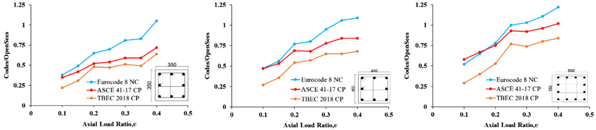

---
Subasi, I., Caglar, N., Olabi, M. N., & Kasap, H. (2023). Evaluation of the performance limit states in codes for RC columns under different axial loads. Arabian Journal for Science and Engineering, 48(10), 13031–13045.
---

Subasi et al 2023 @AJSE
===

Evaluation of the Performance Limit States in Codes for RC Columns Under Different Axial Loads
---

[Ilker Subaşi](https://scholar.google.com/citations?user=Dw_inioAAAAJ&hl=en)
[Naci Çağlar](https://scholar.google.com/citations?user=FteD3gkAAAAJ&hl=en)
[M. Nadir Olabi](https://scholar.google.com/citations?user=w6WuU8sAAAAJ&hl=en&oi=ao)
[Huseyin Kasap](https://scholar.google.com/citations?user=RwLMUToAAAAJ&hl=en&oi=ao)

> [DOI: 10.1007/s13369-023-07647-6](https://doi.org/10.1007/s13369-023-07647-6)

Reinforced concrete columns that are not designed according to current seismic codes may be damaged under the earthquakes loads, which may cause the reinforced concrete buildings to collapse. The response of RC columns subjected to earthquake loads has to be examined in order to determine the seismic performance of RC buildings. The performance of RC columns is determined by using the deformation-based performance limit values given in the seismic codes. In this study, the effectiveness of performance limits proposed for RC columns in current seismic codes is examined quantitatively. A nonlinear finite element model was developed and verified using results of experimental studies selected from the literature. A parametric study was carried out to evaluate the performance of the state limits proposed in the codes. It is concluded that the performance limits values in TBEC 2018 are generally quite conservative compared to the values in Eurocode 8 and ASCE 41–17. This was clearly seen in low axial load levels where the effective performance is restricted to 22–53% of the actual column capacity, which limits the use of the potential ductile behavior in columns dominant by flexural response. Moreover, the study shows that the axial load level is a very important parameter in determining the performance levels according to the standards, and it is recommended that the codes used in the study update their performance levels to consider axial load variation effects.

