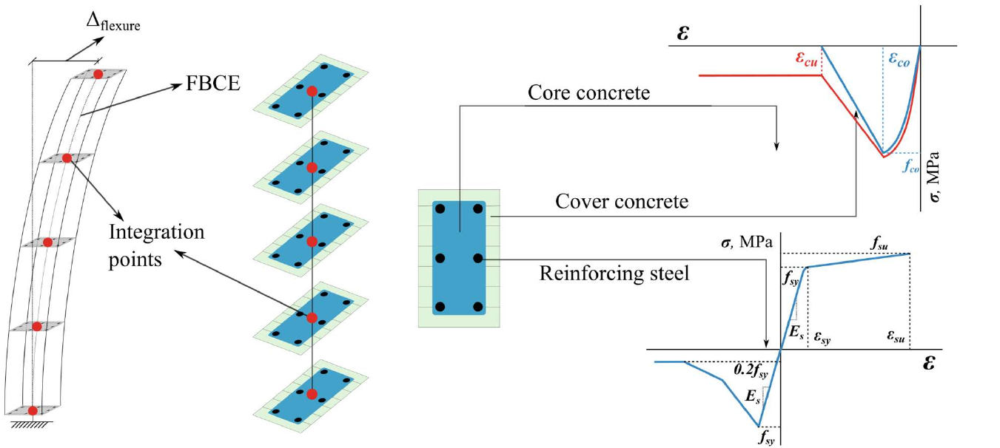
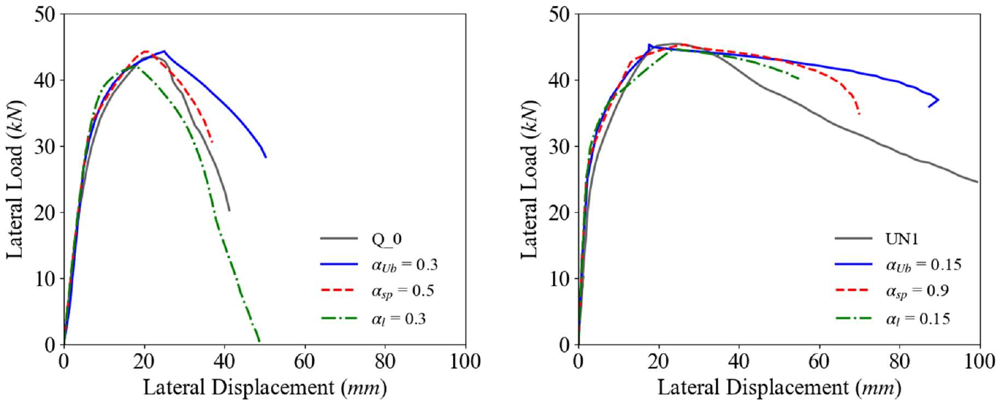

Olabi 2024 @INERS.Düzce
===

Parametric Evaluation of Slip Models for Reinforced Concrete Columns with Smooth Bars
---

[M. Nadir Olabi](https://scholar.google.com/citations?user=w6WuU8sAAAAJ&hl=en&oi=ao)

> ISBN: 978-625-6330-05-4

The seismic risk associated with old and existing buildings in Türkiye has surged in significance, emphasizing the need for a detailed exploration of their behavior, particularly in the face of earthquake hazards. Given the widespread use of smooth bars in older reinforced elements, understanding the nonlinear response of these elements is imperative for robust assessment studies. This research inspects the nonlinear behavior of reinforced concrete columns constructed with smooth bars. Employing a numerical model developed utilizing the OpenSees platform, the study meticulously compares results with experiments conducted on similar columns. Moreover, the investigation evaluates the main parameters governing three widely-used slip models to comprehend their impact on the overall column response, and provides recommendations for suitable values. Findings underscore that slip models designed for ribbed bars exhibit limited suitability for columns featuring smooth bars. Additionally, modifications to these models are considered essential to incorporate axial load forces, given the significant influence of axial load ratio on the behavior of columns with smooth bars.

